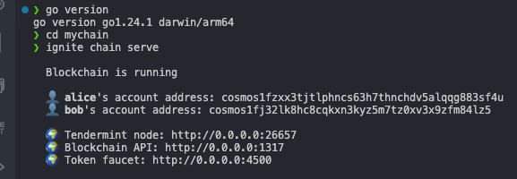
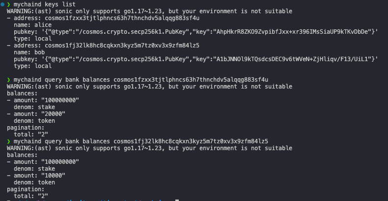
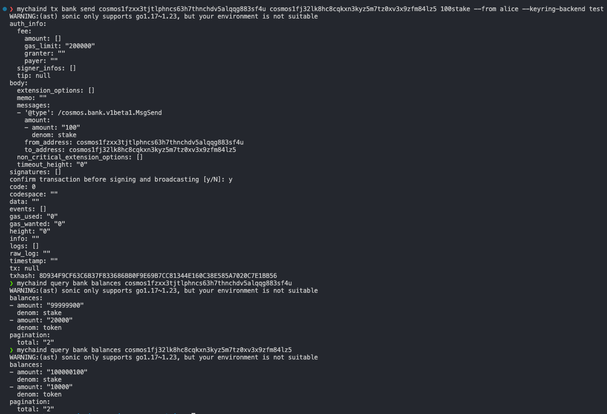

# create chain
```sh
ignite chain serve
```



# check balance


```sh
    mychaind query bank balances cosmos1fzxx3tjtlphncs63h7thnchdv5alqqg883sf4u   
    mychaind query bank balances cosmos1fj32lk8hc8cqkxn3kyz5m7tz0xv3x9zfm84lz5          
```

# send tokens
 ```sh
mychaind tx bank send cosmos1fzxx3tjtlphncs63h7thnchdv5alqqg883sf4u cosmos1fj32lk8hc8cqkxn3kyz5m7tz0xv3x9zfm84lz5 100stake --from alice --keyring-backend test
 ```



# query tx by event
```sh
mychaind query txs --query "transfer.recipient='cosmos1fj32lk8hc8cqkxn3kyz5m7tz0xv3x9zfm84lz5'" --page 1 --limit 30 -o json
```